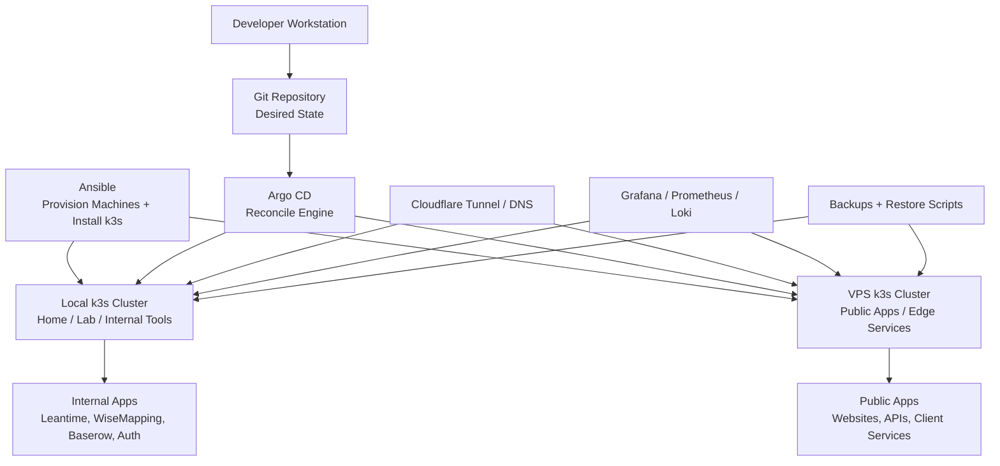

# The Keep Platform

The Keep Platform is a small, self-hosted GitOps platform for running internal tools, public apps, and startup infrastructure across local hardware and VPS providers.

It uses Ansible to provision machines, k3s to run workloads, and Argo CD to keep deployed services aligned with Git.

## 60-Second Summary

- This repo defines a recoverable, production-like platform on k3s.
- Ansible provisions hosts, installs k3s, seeds secrets, and bootstraps Argo CD.
- Kubernetes manifests and Helm values are the desired state.
- Argo CD continuously reconciles that desired state from Git.
- Cloudflare Tunnel exposes selected services without opening the LAN origin.
- Grafana, Prometheus, Loki, and Promtail provide observability.
- Scripts are helpers. Git and the Ansible playbook are the source of truth.
- Current status is production-like, but not fully high-availability yet.

## Platform Shape



### Mental Model

```text
Ansible builds the machines.
k3s runs the workloads.
Argo CD keeps the cluster matching Git.
Cloudflare exposes selected services safely.
Monitoring tells us when things are broken.
Backups make the platform recoverable.
```

### Current Status

```text
Current target:
  Recoverable, production-like single-cluster platform.

Not yet:
  Full high-availability production platform.

Future target:
  Multi-cluster, provider-portable platform across local hardware and VPS providers.
```

HA means high availability: the system can survive the loss of one machine, process, or zone without taking the platform down.

The synthetic demo scenario and reset contract are in
[`demo/README.md`](demo/README.md).

## What To Do First

For a new production-like deployment:

1. Copy `ansible/inventory.production.ini.example` to `ansible/inventory.production.ini`.
2. Copy `ansible/production_vars.yml.example` to ignored `ansible/production_vars.yml`.
3. Fill in required secrets, Cloudflare tunnel token, and GitOps settings.
4. Confirm the GitOps manifests under `kubernetes/gitops/root` and `kubernetes/gitops/apps` match the templates and are pushed to `gitops_repo_url` / `gitops_revision`.
5. Run the production playbook:

```bash
ansible-playbook -K -i ansible/inventory.production.ini ansible/setup_k3s_production.yml
```

The playbook provisions k3s, creates the `k3s-admin` user, applies platform secrets, bootstraps Argo CD, and runs validation gates.

## How It Works

- `Ansible`: machine provisioning, k3s install, secret seeding, Argo CD bootstrap, validation.
- `k3s`: Kubernetes runtime for workloads, networking, storage claims, and service discovery.
- `Argo CD`: cluster-side GitOps controller that applies and reconciles manifests and Helm charts from Git.
- `Helm`: chart packaging for third-party platform services like monitoring and Loki.
- `Cloudflare Tunnel`: edge path for public HTTPS hostnames without exposing the LAN origin directly.
- `Grafana / Prometheus / Loki`: observability, alerts, dashboards, and log investigation.
- `Backups`: current database backup jobs and restore helpers, with off-cluster replication still to harden.

Operationally:

1. Ansible creates a healthy cluster.
2. Argo CD owns day-2 reconciliation.
3. Helm charts are consumed through Argo CD apps.
4. Validation gates check GitOps state, app health, backups, HTTPS endpoints, and observability.

## Current Maturity and Limits

This stack is recoverable and production-like, but not fully high-availability yet.

Current constraints:

- Single k3s server/control-plane failure domain.
- Storage and backup strategy is not fully hardened for disaster recovery.
- Backups are currently stored on-cluster with local PVCs. Off-cluster replication, such as S3 or rsync, must be configured externally for true disaster recovery.
- Secrets are improved but still not at final state. Target direction is SOPS or External Secrets.
- Public HTTPS assumes the GitOps-managed `platform-cloudflare-tunnel` app terminates TLS at the Cloudflare edge and forwards to internal Traefik Ingress.
- Ingress resources and the Cloudflare Tunnel are configured for secure traffic flow. The internal hop between Tunnel and Traefik uses HTTPS with self-signed certificates, so Cloudflare origins need "No TLS Verify" enabled.
- Production deployment is integrated into Ansible. The removed legacy `bootstrap-production.sh` flow should not be treated as source of truth.

Target for full production:

- Multi-server k3s with etcd quorum.
- Separate worker nodes where useful.
- Replicated persistent storage and tested restore runbooks.
- Encrypted or externally managed secrets.
- Routine failure drills with defined RPO/RTO targets.

## App Developers: Architecture You Deploy On

- App deployment contract is Kubernetes manifests and Helm values in Git.
- Argo CD continuously reconciles to Git state.
- Runtime secrets come from Kubernetes Secrets today and should evolve to external or encrypted secret management.
- Deployments should assume eventual multi-node scheduling, even if the current cluster is single-node.

### Developer Rules Of Thumb

- Start with the purpose of the change: user value, business need, operational risk, or learning goal.
- Git is the source of truth. Argo CD deploys what is committed and pushed to the configured GitOps revision.
- Keep one branch focused on one operational concern. Do not mix hotfixes, feature work, experiments, and project-management artifacts.
- Prefer small, boring, reversible changes that are easy to review.
- Treat `ansible-playbook`, Argo CD syncs, and direct `kubectl` changes as live infrastructure operations.
- Prefer durable changes in Ansible, Kubernetes manifests, or Helm values over manual cluster edits.
- If a manual cluster action is required, document it and reconcile the lasting state back into Git.
- Never commit production secrets. `ansible/production_vars.yml` is local-only and ignored by Git.
- Avoid new production dependencies unless they are worth their long-term operational cost.
- Test static rendering and local smoke paths before applying changes to production.
- Make observability and rollback part of every service change, especially for public endpoints and stateful workloads.

### Human And AI Collaboration

- Humans own product intent, production risk, secrets, live approvals, and final merge decisions.
- AI agents can inspect the repository, draft commands, edit reviewable files, and summarize evidence.
- AI agents must ask before destructive commands, privileged operations, live cluster changes, or scripts that mutate external systems.
- AI agents should preserve unrelated worktree changes and call out dirty state instead of cleaning it up.
- Human and AI contributors should challenge requests when the proposed implementation does not match the actual goal or creates avoidable operational burden.
- Prefer reviewable files, dry runs, and copy/paste commands over hidden automation for one-time operations.

### Before Merging

For infrastructure changes, confirm the relevant items before merging:

- Static checks pass, such as `scripts/test-iac-static.sh` when it applies.
- Ansible syntax or playbook checks were run for changed playbooks and roles.
- Local k3d smoke or observation checks were run for app changes when practical.
- GitOps manifests do not accidentally target a feature branch unless that is intentional for testing.
- No secrets, tokens, passwords, kubeconfigs, or private keys are committed.
- Rollout, validation, and rollback steps are clear enough for another engineer to follow.

## Operations Runbook

This section keeps the operational detail out of the top-level overview while preserving the commands needed to run the platform.

### Production Setup From Scratch

This assumes a fresh Ubuntu/Debian host and no existing infrastructure.

#### 1. Cloudflare Prerequisite

1. Create a tunnel in Cloudflare Zero Trust: Networks -> Tunnels.
2. Copy the tunnel token from the installation instructions.
3. Add public hostnames for the externally reachable services:
   - `auth.thekeepstudios.com`
   - `projects.thekeepstudios.com`
   - `mindmaps.thekeepstudios.com`
   - `baserow.thekeepstudios.com`
   - `grafana.thekeepstudios.com`
   - `prometheus.thekeepstudios.com`
   - `alerts.thekeepstudios.com`
   - `argocd.thekeepstudios.com`
4. For each hostname:
   - Service type: `HTTPS`
   - URL: `traefik.kube-system.svc.cluster.local`
   - Origin setting: enable `No TLS Verify`

#### 2. Local Environment Preparation

```bash
cp ansible/inventory.production.ini.example ansible/inventory.production.ini
cp ansible/production_vars.yml.example ansible/production_vars.yml
```

Edit `ansible/inventory.production.ini` and `ansible/production_vars.yml`. The production vars file is ignored by Git to avoid committing secrets.

#### 3. Private Repository Access

If the GitOps repository is private, configure Argo CD credentials before bootstrap. Set `gitops_repo_private: true` and provide one supported credential form in `ansible/production_vars.yml`.

```yaml
gitops_repo_ssh_private_key_path: /path/to/argocd-readonly-key
# or gitops_repo_username/gitops_repo_password for HTTPS repositories
```

Without credentials, the playbook fails before bootstrap.

#### 4. Run Full Deployment

```bash
ansible-playbook -K -i ansible/inventory.production.ini ansible/setup_k3s_production.yml
```

This replaces the legacy script-based flow:

- `seed-platform-secrets.sh`
- `bootstrap-gitops.sh`
- `validate-production-gate.sh`

### Running From A Workstation

The Ansible controller does not need to be the k3s control-plane host. The production inventory should point at the control-plane host over SSH:

```ini
[k3s_control_plane]
framework-desktop ansible_host=192.168.0.46 ansible_user=iantsmall

[k3s_control_plane:vars]
ansible_connection=ssh
ansible_become=true
```

Before running the production playbook from a workstation:

1. Confirm SSH and sudo access to the control-plane host:

```bash
ansible -K -i ansible/inventory.production.ini k3s_control_plane -m ping
```

2. Confirm the local checkout is on the intended branch and `HEAD` is pushed to `gitops_repo_url` / `gitops_revision`.
3. For feature-branch testing, set ignored `ansible/production_vars.yml` and committed GitOps manifests to the same branch. Revert both back to `main` before merge.
4. Run the playbook from the workstation:

```bash
ansible-playbook -K -i ansible/inventory.production.ini ansible/setup_k3s_production.yml
```

The playbook renders templates and performs Git checks on the workstation, then runs Kubernetes commands on the remote control-plane host as `k3s-admin`.

### Validation Path

Confirm control plane and pods:

```bash
sudo -u k3s-admin -H env KUBECONFIG=/home/k3s-admin/.kube/config kubectl get nodes
sudo -u k3s-admin -H env KUBECONFIG=/home/k3s-admin/.kube/config kubectl get pods -A
```

Run validation through Ansible:

```bash
ansible-playbook -i ansible/inventory.production.ini ansible/setup_k3s_production.yml --tags validation
```

The gate fails if Prometheus or Alertmanager return unauthenticated `2xx`. They must be behind Cloudflare Access or an equivalent auth boundary. Prometheus and Alertmanager are currently protected with Traefik BasicAuth until Authentik provider setup is automated.

The direct HTTP origin check allows an empty connection, curl `000`, or Traefik's default `404`. It fails if the LAN origin serves an application over plain HTTP.

Live evidence required before claiming GO:

- production playbook output;
- GitOps render and committed-state comparison output;
- clean staged, unstaged, and untracked GitOps checks;
- `git ls-remote` proof that local `HEAD` matches the configured GitOps target;
- Argo app sync and health output;
- Cloudflare HTTPS endpoint results;
- direct-origin block results;
- in-cluster `PrometheusRule` containing backup and platform visibility alerts;
- in-cluster WiseMapping API validation against `/api/restful/app/config`;
- in-cluster Loki volume API validation for Grafana Logs Drilldown;
- Leantime backup Job and readable non-empty backup artifact verification.

### Internal Launch Checklist

For internal usage with minimal risk reduction:

1. Ensure Leantime is healthy:

```bash
sudo -u k3s-admin -H env KUBECONFIG=/home/k3s-admin/.kube/config kubectl get deploy leantime leantime-mariadb
```

2. Take an immediate DB backup before team onboarding:

```bash
bash scripts/backup-leantime-now.sh
```

3. Verify scheduled backups are active:

```bash
sudo -u k3s-admin -H env KUBECONFIG=/home/k3s-admin/.kube/config kubectl get cronjob leantime-db-backup
```

4. Keep restore command ready for incident response:

```bash
bash scripts/restore-leantime-backup.sh /path/to/backup.sql.gz
```

### Cluster Inspection

Run cluster inspection commands as `k3s-admin` on the production host:

```bash
kubectl get nodes
```

If you are not already in a `k3s-admin` shell, prefix commands with:

```bash
sudo -u k3s-admin -H env KUBECONFIG=/home/k3s-admin/.kube/config
```

When the production playbook is waiting for Argo CD reconciliation, inspect GitOps applications from another terminal:

```bash
kubectl get applications -n argocd
kubectl get applications -n argocd \
  -o custom-columns=NAME:.metadata.name,SYNC:.status.sync.status,HEALTH:.status.health.status,REVISION:.status.sync.revision
```

Describe the root app or any child app that is not fully synced and healthy:

```bash
kubectl describe application platform-root -n argocd
kubectl describe application platform-monitoring-loki -n argocd
kubectl get application platform-monitoring-loki -n argocd \
  -o jsonpath='{range .status.resources[?(@.status=="OutOfSync")]}{.kind}{" "}{.namespace}{" "}{.name}{"\n"}{end}'
kubectl exec -n argocd statefulset/argocd-application-controller -- \
  sh -lc 'argocd app diff platform-monitoring-loki --core; echo exit=$?'
```

Check pods and recent cluster events when an app is `Progressing` or `OutOfSync`:

```bash
kubectl get pods -A
kubectl get events -A --sort-by=.lastTimestamp
```

Useful Argo CD controller logs:

```bash
kubectl logs -n argocd deployment/argocd-repo-server --tail=100
kubectl logs -n argocd statefulset/argocd-application-controller --tail=100
```

Argo status hints:

- `Synced` + `Healthy`: desired state is applied and healthy.
- `Synced` + `Progressing`: manifests applied, but workload readiness is still settling.
- `OutOfSync` + `Healthy`: live resources differ from Git. Inspect `kubectl describe application ...` before changing anything.
- `Missing` or `Degraded`: treat as a blocker and inspect app description, pods, and events.

### Loki Logs In Grafana

- The `Loki` data source is provisioned by the monitoring chart and selected by dashboard variable.
- The `Leantime Logs` dashboard is provisioned from `kubernetes/platform/monitoring/access/leantime-logs-dashboard.yaml`.
- Grafana Logs Drilldown needs Loki's `/loki/api/v1/index/volume` API enabled. The validation playbook checks this endpoint from inside the cluster.
- `platform-monitoring-loki` uses the current community Loki chart in monolithic mode with pattern ingestion, structured metadata, log-level discovery, and volume queries enabled.
- Promtail is installed as an explicit chart source for log shipping. Promtail is deprecated upstream, so the next logging-agent hardening task is migrating log shipping to Grafana Alloy.

In Grafana Explore:

```logql
{namespace="default", pod=~"leantime-.*"}
```

For invite, reset, and mail debugging:

```logql
{namespace="default", pod=~"leantime-.*"} |~ "(?i)(500|error|exception|failed|warning|smtp|mail|invite|reset|password)"
```

For WiseMapping API failures:

```logql
{namespace="wisemapping", pod=~"wisemapping-.*"} |~ "(?i)(error|exception|failed|fatal|spring|oauth|postgres|jdbc|502|api/restful/app/config)"
```

Platform visibility alerts:

- `WiseMappingBackendUnavailable` catches the nginx-up/API-down failure mode by making the WiseMapping probe hit `/api/restful/app/config`.
- `GrafanaUnavailable`, `LokiUnavailable`, and `PromtailUnavailable` catch loss of the observability stack itself.
- These alerts are Prometheus rules managed by `kubernetes/platform/monitoring/kube-prometheus-stack.values.yaml`.

Force Argo CD to recompare an app after a live investigation or manual test:

```bash
kubectl annotate application platform-monitoring-loki -n argocd \
  argocd.argoproj.io/refresh=hard --overwrite
kubectl annotate application platform-root -n argocd \
  argocd.argoproj.io/refresh=hard --overwrite
```

### OIDC Notes

Authentik is the intended internal identity hub. Configure Google once in Authentik upstream.
For the platform-wide forward-auth path, see `docs/authentik-sso.md`.

Callback URLs:

- Leantime: `https://projects.thekeepstudios.com/oidc/callback`
- WiseMapping: `https://mindmaps.thekeepstudios.com/login/oauth2/code/google`

Issuer format:

```text
https://auth.thekeepstudios.com/application/o/<provider-slug>/
```

Set Leantime OIDC values in ignored `ansible/production_vars.yml` under `platform_oidc.leantime`.

WiseMapping does not currently render a Spring OAuth client registration while OIDC is disabled. Add an Authentik-backed registration deliberately when WiseMapping SSO is implemented.

Authentik bootstrap behavior:

- `AUTHENTIK_BOOTSTRAP_PASSWORD` is only read on first startup with a fresh Authentik DB.
- Reset admin password later with:

```bash
sudo -u k3s-admin -H env KUBECONFIG=/home/k3s-admin/.kube/config \
kubectl exec -it deployment/authentik-server -n identity -- ak changepassword akadmin
```

### Leantime Email

Leantime SMTP settings live in ignored `ansible/production_vars.yml` under `platform_email.leantime`. The playbook creates the `leantime-email` Kubernetes Secret and restarts Leantime only when SMTP settings change.

For production transactional mail, use Mailgun SMTP. Mailgun's Free plan currently includes 100 messages per day and one custom sending domain, which is enough for low-volume Leantime invitations and password resets.

Recommended shape:

- Mailgun sending domain: `mg.thekeepstudios.com`
- Leantime return address: `noreply@mg.thekeepstudios.com`
- SMTP host: `smtp.mailgun.org`
- SMTP port/security: `587` with `STARTTLS`
- SMTP username: Mailgun domain SMTP login, commonly `postmaster@mg.thekeepstudios.com`

Use `smtp.eu.mailgun.org` instead if the Mailgun sending domain is created in the EU region.

Mailgun setup checklist:

1. Add `mg.thekeepstudios.com` as a Mailgun sending domain.
2. Publish the DNS records Mailgun provides for SPF, DKIM, tracking, and MX if required.
3. Wait for Mailgun to verify the domain.
4. Copy the Mailgun SMTP username/password into ignored `ansible/production_vars.yml`.

After editing `ansible/production_vars.yml`, apply with:

```bash
ansible-playbook -K -i ansible/inventory.production.ini ansible/setup_k3s_production.yml
```

### Migration From Legacy Script-Managed Cluster

If a cluster was previously deployed through legacy standalone scripts, migrate to the Ansible-first flow:

1. Copy `ansible/production_vars.yml.example` to ignored `ansible/production_vars.yml` and set current production secrets there.
2. Run the production playbook:

```bash
ansible-playbook -i ansible/inventory.production.ini ansible/setup_k3s_production.yml
```

Migration safety:

- Existing resources are reused or adopted.
- Monitoring apps reuse release names `kube-prometheus-stack` and `loki`.
- Most GitOps app definitions use `prune: false` to reduce accidental deletion risk during migration. The Loki app enables pruning because chart migration requires stale resource cleanup.
- `bootstrap-production.sh` is removed. Day-2 changes happen through Git and Argo CD.

### Destructive Operations Policy

`teardown-cluster.sh` is demo/lab only.

Lab teardown:

```bash
TEARDOWN_CONFIRM=destroy-k3s ./teardown-cluster.sh --force
```

Production-like guard override:

```bash
ALLOW_PRODUCTION_TEARDOWN=true TEARDOWN_CONFIRM=destroy-k3s ./teardown-cluster.sh --force
```

## Planned Hardening

This is the backlog for moving from production-like to high availability:

- 3-node k3s control plane with etcd quorum plus separate workers.
- Backup immutability and off-cluster replication for etcd and databases.
- Admission policies to block deletes in critical namespaces by default.
- Strict RBAC with break-glass admin flow and short-lived elevated access.
- Branch protections and mandatory reviews for infrastructure paths.
- Scheduled restore drills with defined RPO/RTO targets.
- Secret management migration to SOPS or External Secrets.
- Formal IaC test workflow before merge: local static checks, Helm rendering, server-side dry-run, feature-branch Argo app testing, and final validation playbook gates.
- Migrate log shipping from deprecated Promtail to Grafana Alloy.
- Automate Authentik application/provider setup for bundled apps instead of requiring manual UI setup.
- Generate or reconcile Leantime OIDC client credentials and write them into the `leantime-oidc` secret.
- Validate Leantime SMTP delivery with a real invitation/password-reset smoke test after SMTP credentials are configured.
- Keep the automation suitable for open-source reuse by documenting required domain names, redirect URLs, and operator-provided secrets.

## File Map

- k3s production bootstrap playbook: `ansible/setup_k3s_production.yml`
- Argo platform install: `kubernetes/platform/argocd/*`
- Cloudflare Tunnel edge deployment: `kubernetes/platform/cloudflared/*`
- GitOps apps/root: `kubernetes/gitops/*`
- Leantime backup CronJob: `kubernetes/apps/leantime/backup-cronjob.yaml`
- Leantime UI/MCP route contract: `docs/leantime-mcp-routing.md`
- Leantime UI/MCP route probe: `scripts/check-leantime-routing.sh`
- Runtime env template: `scripts/production.env.example`
- OIDC reconcile helper: `scripts/reconcile-oidc.sh`
- Leantime on-demand backup: `scripts/backup-leantime-now.sh`
- Leantime restore helper: `scripts/restore-leantime-backup.sh`
- Deprecated GitOps manifest renderer: `scripts/render-gitops-apps.sh`
- Deprecated GitOps bootstrap helper: `scripts/bootstrap-gitops.sh`
- Deprecated production launch gate: `scripts/validate-production-gate.sh`
- Deprecated secrets seed helper: `scripts/seed-platform-secrets.sh`
