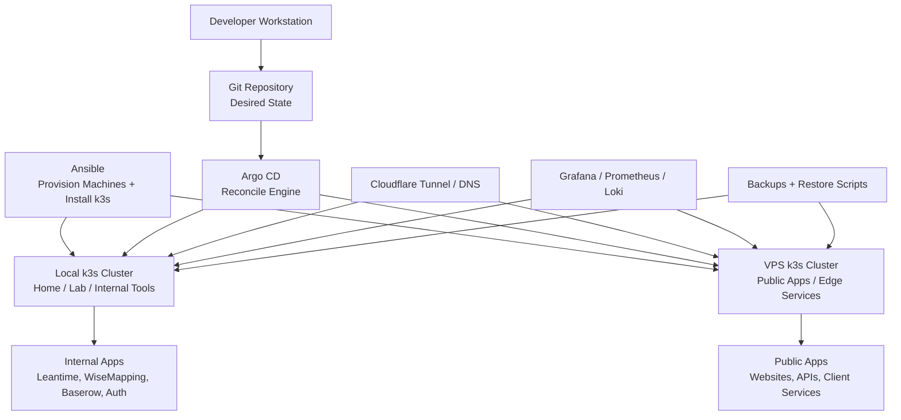

# The Keep Platform

The Keep Platform is a small, self-hosted GitOps platform for running internal tools, public apps, and startup infrastructure across local hardware and VPS providers.

It uses Ansible to provision machines, k3s to run workloads, and Argo CD to keep deployed services aligned with Git.

## Contents

- [60-Second Summary](#60-second-summary)
- [Platform Shape](#platform-shape)
- [What To Do First](#what-to-do-first)
- [How It Works](#how-it-works)
- [Current Maturity and Limits](#current-maturity-and-limits)
- [App Developers: Architecture You Deploy On](#app-developers-architecture-you-deploy-on)
- [TODO Ledger](#todo-ledger)
- [Quality Checks](#quality-checks)
- [Local Testing And Observation](#local-testing-and-observation)
- [Operations Runbook](#operations-runbook)
- [Auth, OIDC, And Routing Notes](#auth-oidc-and-routing-notes)
- [Optional CRM And Assistant](#optional-crm-and-assistant)
- [Host Disk Pressure Check](#host-disk-pressure-check)
- [Planned Hardening](#planned-hardening)
- [File Map](#file-map)

## 60-Second Summary

- This repo defines a recoverable, production-like platform on k3s.
- Ansible provisions hosts, installs k3s, seeds secrets, and bootstraps Argo CD.
- Kubernetes manifests and Helm values are the desired state.
- Argo CD continuously reconciles that desired state from Git.
- Cloudflare Tunnel exposes selected services without opening the LAN origin.
- Grafana, Prometheus, Loki, and Promtail provide observability.
- Scripts are helpers. Git and the Ansible playbook are the source of truth.
- Current status is production-like, but not fully high-availability yet.

## Platform Shape



### Mental Model

```text
Ansible builds the machines.
k3s runs the workloads.
Argo CD keeps the cluster matching Git.
Cloudflare exposes selected services safely.
Monitoring tells us when things are broken.
Backups make the platform recoverable.
```

### Current Status

```text
Current target:
  Recoverable, production-like single-cluster platform.

Not yet:
  Full high-availability production platform.

Future target:
  Multi-cluster, provider-portable platform across local hardware and VPS providers.
```

HA means high availability: the system can survive the loss of one machine, process, or zone without taking the platform down.

The synthetic demo scenario and reset contract are in
[`demo/README.md`](demo/README.md).

## What To Do First

For local review without creating a cluster:

```bash
scripts/check-local-prereqs.sh static
ansible-playbook -i ansible/inventory.ini ansible/setup_dev_environment.yml \
  -e local_dev_profile=static
```

For the disposable local k3d sandbox:

```bash
scripts/check-local-prereqs.sh sandbox
ansible-playbook -i ansible/inventory.ini ansible/setup_dev_environment.yml
```

The supported profiles, smoke tests, and observation paths are summarized in
[Local Testing And Observation](#local-testing-and-observation).

For a new production-like deployment:

1. Copy `ansible/inventory.production.ini.example` to `ansible/inventory.production.ini`.
2. Copy `ansible/production_vars.yml.example` to ignored `ansible/production_vars.yml`.
3. Fill in required secrets, Cloudflare tunnel token, and GitOps settings.
4. Confirm the GitOps manifests under `kubernetes/gitops/root` and `kubernetes/gitops/apps` match the templates and are pushed to `gitops_repo_url` / `gitops_revision`.
5. Run the production playbook:

```bash
ansible-playbook -K -i ansible/inventory.production.ini ansible/setup_k3s_production.yml
```

The playbook provisions k3s, creates the `k3s-admin` user, applies platform secrets, bootstraps Argo CD, and runs validation gates.

## How It Works

- `Ansible`: machine provisioning, k3s install, secret seeding, Argo CD bootstrap, validation.
- `k3s`: Kubernetes runtime for workloads, networking, storage claims, and service discovery.
- `Argo CD`: cluster-side GitOps controller that applies and reconciles manifests and Helm charts from Git.
- `Helm`: chart packaging for third-party platform services like monitoring and Loki.
- `Cloudflare Tunnel`: edge path for public HTTPS hostnames without exposing the LAN origin directly.
- `Grafana / Prometheus / Loki`: observability, alerts, dashboards, and log investigation.
- `Backups`: current database backup jobs and restore helpers, with off-cluster replication still to harden.

Operationally:

1. Ansible creates a healthy cluster.
2. Argo CD owns day-2 reconciliation.
3. Helm charts are consumed through Argo CD apps.
4. Validation gates check GitOps state, app health, backups, HTTPS endpoints, and observability.

## Current Maturity and Limits

This stack is recoverable and production-like, but not fully high-availability yet.

Current constraints:

- Single k3s server/control-plane failure domain.
- Storage and backup strategy is not fully hardened for disaster recovery.
- Backups are currently stored on-cluster with local PVCs. Off-cluster replication, such as S3 or rsync, must be configured externally for true disaster recovery.
- Secrets are improved but still not at final state. Target direction is SOPS or External Secrets.
- Public HTTPS assumes the GitOps-managed `platform-cloudflare-tunnel` app terminates TLS at the Cloudflare edge and forwards to internal Traefik Ingress.
- Ingress resources and the Cloudflare Tunnel are configured for secure traffic flow. The internal hop between Tunnel and Traefik uses HTTPS with self-signed certificates, so Cloudflare origins need "No TLS Verify" enabled.
- Production deployment is integrated into Ansible. The removed legacy `bootstrap-production.sh` flow should not be treated as source of truth.

Target for full production:

- Multi-server k3s with etcd quorum.
- Separate worker nodes where useful.
- Replicated persistent storage and tested restore runbooks.
- Encrypted or externally managed secrets.
- Routine failure drills with defined RPO/RTO targets.

## App Developers: Architecture You Deploy On

- App deployment contract is Kubernetes manifests and Helm values in Git.
- Argo CD continuously reconciles to Git state.
- Runtime secrets come from Kubernetes Secrets today and should evolve to external or encrypted secret management.
- Deployments should assume eventual multi-node scheduling, even if the current cluster is single-node.
- Supported apps should follow the contract below: explicit namespace,
  workloads, storage, secrets, networking, probes, backup, validation, and
  rollback boundaries.

### Developer Rules Of Thumb

- Start with the purpose of the change: user value, business need, operational risk, or learning goal.
- Git is the source of truth. Argo CD deploys what is committed and pushed to the configured GitOps revision.
- Keep one branch focused on one operational concern. Do not mix hotfixes, feature work, experiments, and project-management artifacts.
- Prefer small, boring, reversible changes that are easy to review.
- Treat `ansible-playbook`, Argo CD syncs, and direct `kubectl` changes as live infrastructure operations.
- Prefer durable changes in Ansible, Kubernetes manifests, or Helm values over manual cluster edits.
- If a manual cluster action is required, document it and reconcile the lasting state back into Git.
- Never commit production secrets. `ansible/production_vars.yml` is local-only and ignored by Git.
- Avoid new production dependencies unless they are worth their long-term operational cost.
- Test static rendering and local smoke paths before applying changes to production.
- Make observability and rollback part of every service change, especially for public endpoints and stateful workloads.

### App Support Contract

Use this shape for apps managed by Kubernetes manifests, Helm values,
Ansible-rendered secrets, Argo CD applications, or local dev smoke/observe
scripts. Do not use it to justify broad rewrites; explicit manifests are fine
when they make security, storage, or runtime behavior easier to review.

Each supported app should define:

- Purpose: internal, public, optional, demo-only, or production-supported.
- Runtime owner: GitOps-only, Ansible-seeded, or still partly manual.
- Namespace, workloads, storage, secrets, config, networking, probes, backups,
  validation, and rollback.
- Required operator-provided values without committing private installation
  configuration.

Preferred Kubernetes app layout:

```text
kubernetes/apps/<app>/
  kustomization.yaml
  production.yaml
  backup-cronjob.yaml       # when the app has durable data
  secret.example.yaml       # when operators must provide Kubernetes secrets
```

Public support configuration belongs in tracked files only when it is safe and
reusable: manifests, Helm values, examples, non-secret defaults, validation
scripts, and generic operator guidance. Private installation config does not
belong in Git: production passwords, tokens, kubeconfigs, local inventories,
customer-specific values, generated artifacts, screenshots, or local agent
memory.

Public app support and private app instances are different artifacts:

- Public app support answers whether TKP can deploy and operate an app type.
- Private app instances answer which concrete instances run for one
  installation, with real hostnames, secret names, storage/database bindings,
  account identifiers, provider credentials, and policy.

Use the app-instance model only when a real consumer needs it. Fake examples
live in `examples/app-instances.example.json`, and
`scripts/test-app-instance-examples.py` validates that they stay fake, unique,
and structurally useful.

Minimal app-instance fields:

```yaml
app_instances:
  - app_type: baserow
    instance_name: example-client-baserow
    namespace: example-client-baserow
    hostname: data.example-client.invalid
    access_policy: internal-authenticated
    exposure:
      public_ingress: true
      cloudflare_tunnel_route: true
    storage:
      pvc_prefix: example-client-baserow
      database_binding: example-client-baserow-db
    secrets:
      app_secret_ref: example-client-baserow-app-secret
      oidc_secret_ref: example-client-baserow-oidc-secret
    backups:
      enabled: true
      schedule: "17 3 * * *"
      retention: 14d
```

Instance rules:

- Use one namespace per externally meaningful instance unless sharing is
  deliberate and documented.
- Prefix Deployments, Services, PVCs, database names, backup jobs, and secret
  refs with `instance_name`.
- Never reuse PVCs, databases, hostnames, OAuth clients, mailboxes, or provider
  credentials across unrelated instances.
- Keep secret values in platform secret storage or a private installation repo.

Manifest rules:

- Use one namespace per app unless it deliberately belongs in a shared platform
  namespace.
- Pin third-party app image tags or digests for production-supported workloads.
- Set resource requests and limits for long-running workloads.
- Prefer named ports and readiness probes that validate a real serving path.
- Keep public URLs, ingress auth, Cloudflare assumptions, and backup behavior
  visible in manifests or README.
- Do not introduce Helm, generators, or custom templating only to reduce line
  count.

Before opening an app-support PR, include relevant evidence:

- `scripts/test-iac-static.sh`
- app-specific dev smoke or observe command when practical;
- `kubectl kustomize kubernetes/apps/<app>` for manifest changes;
- Ansible syntax checks when playbooks, roles, or vars examples change;
- backup/restore evidence when durable data changes;
- rollback notes another engineer can follow.

### Human And AI Collaboration

- Humans own product intent, production risk, secrets, live approvals, and final merge decisions.
- AI agents can inspect the repository, draft commands, edit reviewable files, and summarize evidence.
- AI agents must ask before destructive commands, privileged operations, live cluster changes, or scripts that mutate external systems.
- AI agents should preserve unrelated worktree changes and call out dirty state instead of cleaning it up.
- Human and AI contributors should challenge requests when the proposed implementation does not match the actual goal or creates avoidable operational burden.
- Prefer reviewable files, dry runs, and copy/paste commands over hidden automation for one-time operations.

### Local Automation Fixture

`scripts/run-automation-fixture.py` runs the local fake lead-triage automation
loop for #15 and #28. It reads fake job/client intake data from
`examples/automation-job-source.fixture.json`, prints a deterministic Markdown
triage report, and can write machine-readable dry-run JSON. The workflow covers
a job lead, recruiter email, ATS confirmation, consulting/client inquiry, and
poor-fit rejection. It performs no network calls, uses no secrets, reads no real
Gmail/EspoCRM/Leantime data, and writes no CRM records.

```bash
python3 scripts/run-automation-fixture.py \
  --fixture examples/automation-job-source.fixture.json \
  --json-output .artifacts/automation-triage.dry-run.json
```

To run the same workflow from a fake redacted source export:

```bash
python3 scripts/run-automation-fixture.py \
  --source-export examples/lead-triage-source-export.fixture.json \
  --json-output .artifacts/automation-source-export.dry-run.json
```

Use `--provider local-auto` to detect supported local model CLIs without making
model calls. If no local provider command is present, the runner reports the
skip and still uses the deterministic fake provider. Use `--self-test` to verify
that malformed fixtures fail, missing fields are surfaced, rejected items do not
produce CRM payloads, and Opportunity candidates require reciprocal signal or
explicit override.

### TODO Tracking Standard

Use GitHub as the durable TODO system. Do not rely on private chat memory, local notes, unchecked code comments, or stale PR prose for work that must survive a handoff.

Every non-trivial TODO must be represented in one of these forms:

- GitHub issue: durable backlog item, follow-up, blocker, or acceptance criterion not finished by the current PR.
- PR TODO ledger comment: short-lived checklist for the PR's remaining review, validation, and merge-readiness work.
- Issue TODO ledger comment: current decomposition of a larger issue into ordered, owner-visible next actions.
- Inline code TODO: allowed only when it points to a GitHub issue number and describes a concrete code-local follow-up.

Use this format for TODO ledger comments:

```markdown
## TODO Ledger

- [ ] Owner: <human|agent|PM> | Type: <blocker|follow-up|validation|decision> | Ref: #<issue-or-pr> | Due: <before-merge|next-sprint|later>
      Action: <one concrete next action>
      Evidence: <command, review, PR, issue, or production proof that will close it>
```

Rules:

- A PR may use `Closes #...` only when its merged diff satisfies every acceptance criterion for that issue.
- If a PR is useful but partial, use `Refs #...` and add or link follow-up issues before marking the PR ready for review.
- Broad issues should keep one current TODO ledger comment. Update that comment instead of scattering status across several comments.
- Human-driven tasks must be labeled as human-owned in the ledger; agents should not silently convert them into code changes.
- Before ending a work session, update the relevant PR or issue ledger with what remains, who owns it, and what evidence is needed next.

### Before Merging

For infrastructure changes, confirm the relevant items before merging:

- Repository quality checks pass with `scripts/test-quality.sh`.
- Static checks pass, such as `scripts/test-iac-static.sh` when it applies.
- Ansible syntax or playbook checks were run for changed playbooks and roles.
- Local k3d smoke or observation checks were run for app changes when practical.
- GitOps manifests do not accidentally target a feature branch unless that is intentional for testing.
- No secrets, tokens, passwords, kubeconfigs, or private keys are committed.
- Rollout, validation, and rollback steps are clear enough for another engineer to follow.

### Quality Checks

Run the repo-level quality gate before opening or updating infrastructure PRs:

```bash
scripts/test-quality.sh
```

The current tracked surfaces are shell scripts, Ansible playbooks and roles, Kubernetes YAML, docs, and this GitHub Actions workflow. There are no tracked Python services or container build files on `main` yet, so those checks stay deferred until those surfaces exist on the branch being reviewed.

The first enforced baseline reuses `scripts/test-iac-static.sh`, which already covers Git whitespace, shell syntax, Kustomize rendering, Ansible syntax, and focused EspoCRM validation. Optional stricter tools are wired behind `QUALITY_STRICT=true` and run only when installed:

```bash
QUALITY_STRICT=true scripts/test-quality.sh
```

The default gate also runs `scripts/check-secrets.sh`, a lightweight secret exposure scan for high-confidence private key blocks, common token prefixes, kubeconfig private keys, and private installation config filenames such as `ansible/production_vars.yml`, `ansible/inventory.production.ini`, and `scripts/production.env`.

GitHub Actions linting is promoted as the first traditional external linter. CI installs `actionlint` and runs `scripts/test-quality.sh` with `QUALITY_REQUIRE_ACTIONLINT=true`; local runs use `actionlint` when it is installed and otherwise report a skip.

Use strict mode to keep evaluating `shellcheck`, `shfmt`, `yamllint`, `ruff`, and `hadolint` without turning noisy or branch-specific tools into a default PR blocker too early.

Current quality-gate decisions:

| Check | Default status | Reason |
| --- | --- | --- |
| Secret exposure scan | Enforced locally and in CI | High-confidence patterns only; no broad allowlist that could normalize real secrets. |
| `actionlint` | Enforced in CI; local when installed | One workflow, low-noise validation, no source rewrites required. |
| Kustomize render and Ansible syntax | Enforced | Existing static IaC baseline with useful signal. |
| `kubeconform` / `kubeval` | Opportunistic when installed | Useful schema check, but CRDs and remote bases still need scoped handling before requiring it everywhere. |
| `shellcheck`, `shfmt`, `yamllint`, `ansible-lint` | Strict/evaluation only | Keep out of the default gate until their noise profile is reduced without broad style rewrites. |
| `ruff`, `hadolint` | Deferred until matching files exist | No tracked Python service files or container build files on `main` yet. |

## Local Testing And Observation

The local path has three layers: static checks, disposable k3d workload smoke
tests, and browser observation against the running local app.

Prerequisites:

- Docker or a compatible container runtime.
- `kubectl`
- `k3d`
- `ansible-playbook`
- enough free disk for k3d image storage and local PVCs;
- optional `kubeconform` or `kubeval` for stricter rendered manifest checks.

Check prerequisites without changing anything:

```bash
scripts/check-local-prereqs.sh static
scripts/check-local-prereqs.sh sandbox
```

Run the static gate:

```bash
scripts/test-iac-static.sh
```

Include remote Kustomize bases only when network access is expected:

```bash
IAC_STATIC_INCLUDE_REMOTE=true scripts/test-iac-static.sh
```

Use Ansible for the standard local workflow:

```bash
ansible-playbook -i ansible/inventory.ini ansible/setup_dev_environment.yml
```

Profiles:

```text
static       Static IaC checks only.
wisemapping  Static checks, k3d cluster, WiseMapping smoke test.
leantime     Static checks, k3d cluster, Leantime smoke test.
baserow      Static checks, k3d cluster, Baserow smoke test.
twenty       Static checks, k3d cluster, Twenty smoke test.
espocrm      Static checks, k3d cluster, EspoCRM smoke test.
optional-crm Static checks, k3d cluster, both optional CRM smoke tests.
crm-bakeoff  Compatibility alias for optional-crm.
platform     Static checks, k3d cluster, all local app smoke tests.
```

For static checks only:

```bash
ansible-playbook -i ansible/inventory.ini ansible/setup_dev_environment.yml \
  -e local_dev_profile=static
```

Create or reuse the disposable cluster directly:

```bash
scripts/dev-cluster-up.sh
```

Delete it when finished:

```bash
scripts/dev-cluster-down.sh
```

Run smoke tests:

```bash
scripts/dev-smoke.sh wisemapping
scripts/dev-smoke.sh leantime
scripts/dev-smoke.sh baserow
scripts/dev-smoke.sh twenty
scripts/dev-smoke.sh espocrm
scripts/dev-smoke.sh optional-crm
scripts/dev-smoke.sh platform
```

Run manual observation after smoke tests:

```bash
scripts/dev-observe.sh wisemapping
scripts/dev-observe.sh leantime
scripts/dev-observe.sh baserow
scripts/dev-observe.sh twenty
scripts/dev-observe.sh espocrm
scripts/dev-observe.sh optional-crm
scripts/dev-observe.sh platform
```

Default local URLs:

```text
WiseMapping: http://localhost:18081
Leantime:    http://localhost:18080
Baserow:     http://localhost:18082
Twenty:      http://localhost:18083
EspoCRM:     http://localhost:18084
```

Observation artifacts are written under `.artifacts/dev-observe/` and may
include probe HTML, screenshots, captured page HTML, Chromium logs, and
port-forward logs. To capture artifacts without opening a browser:

```bash
DEV_OBSERVE_OPEN=false DEV_OBSERVE_HOLD=false scripts/dev-observe.sh platform
```

The local sandbox does not test Cloudflare Tunnel, external DNS, real TLS edge
behavior, Authentik integration, Argo CD app-of-apps reconciliation, or
production backup/restore gates. Use it to catch render errors, startup
failures, and service-level smoke failures before pushing a branch to Argo CD.

Common failures:

- missing command: install the named prerequisite and rerun the checker;
- Docker unavailable: make `docker info` work without sudo;
- disk/pressure failure: free space, then recreate the disposable cluster;
- image pull/network failure: retry after registry/network recovery;
- port conflict during observation: set the documented `*_OBSERVE_PORT`
  override.

## Operations Runbook

This section keeps the operational detail out of the top-level overview while preserving the commands needed to run the platform.

### Production Setup From Scratch

This assumes a fresh Ubuntu/Debian host and no existing infrastructure.

#### 1. Cloudflare Prerequisite

1. Create a tunnel in Cloudflare Zero Trust: Networks -> Tunnels.
2. Copy the tunnel token from the installation instructions.
3. Add public hostnames for the externally reachable services:
   - `auth.thekeepstudios.com`
   - `projects.thekeepstudios.com`
   - `mindmaps.thekeepstudios.com`
   - `baserow.thekeepstudios.com`
   - `crm.thekeepstudios.com`
   - `grafana.thekeepstudios.com`
   - `prometheus.thekeepstudios.com`
   - `alerts.thekeepstudios.com`
   - `argocd.thekeepstudios.com`
4. For each hostname:
   - Service type: `HTTPS`
   - URL: `traefik.kube-system.svc.cluster.local`
   - Origin setting: enable `No TLS Verify`

#### 2. Local Environment Preparation

```bash
cp ansible/inventory.production.ini.example ansible/inventory.production.ini
cp ansible/production_vars.yml.example ansible/production_vars.yml
```

Edit `ansible/inventory.production.ini` and `ansible/production_vars.yml`. The production vars file is ignored by Git to avoid committing secrets.

#### 3. Private Repository Access

If the GitOps repository is private, configure Argo CD credentials before bootstrap. Set `gitops_repo_private: true` and provide one supported credential form in `ansible/production_vars.yml`.

```yaml
gitops_repo_ssh_private_key_path: /path/to/argocd-readonly-key
# or gitops_repo_username/gitops_repo_password for HTTPS repositories
```

Without credentials, the playbook fails before bootstrap.

#### 4. Run Full Deployment

```bash
ansible-playbook -K -i ansible/inventory.production.ini ansible/setup_k3s_production.yml
```

This replaces the legacy script-based flow:

- `seed-platform-secrets.sh`
- `bootstrap-gitops.sh`
- `validate-production-gate.sh`

### Running From A Workstation

The Ansible controller does not need to be the k3s control-plane host. The production inventory should point at the control-plane host over SSH:

```ini
[k3s_control_plane]
k3s-control-plane ansible_host=192.0.2.10 ansible_user=platform-admin

[k3s_control_plane:vars]
ansible_connection=ssh
ansible_become=true
```

Before running the production playbook from a workstation:

1. Confirm SSH and sudo access to the control-plane host:

```bash
ansible -K -i ansible/inventory.production.ini k3s_control_plane -m ping
```

2. Confirm the local checkout is on the intended branch and `HEAD` is pushed to `gitops_repo_url` / `gitops_revision`.
3. For feature-branch testing, set ignored `ansible/production_vars.yml` and committed GitOps manifests to the same branch. Revert both back to `main` before merge.
4. Run the playbook from the workstation:

```bash
ansible-playbook -K -i ansible/inventory.production.ini ansible/setup_k3s_production.yml
```

The playbook renders templates and performs Git checks on the workstation, then runs Kubernetes commands on the remote control-plane host as `k3s-admin`.

### Validation Path

Confirm control plane and pods:

```bash
sudo -u k3s-admin -H env KUBECONFIG=/home/k3s-admin/.kube/config kubectl get nodes
sudo -u k3s-admin -H env KUBECONFIG=/home/k3s-admin/.kube/config kubectl get pods -A
```

Run validation through Ansible:

```bash
ansible-playbook -i ansible/inventory.production.ini ansible/setup_k3s_production.yml --tags validation
```

The gate fails if Prometheus or Alertmanager return unauthenticated `2xx`. They must be behind Cloudflare Access or an equivalent auth boundary. Prometheus and Alertmanager are currently protected with Traefik BasicAuth until Authentik provider setup is automated.

The direct HTTP origin check allows an empty connection, curl `000`, or Traefik's default `404`. It fails if the LAN origin serves an application over plain HTTP.

Live evidence required before claiming GO:

- production playbook output;
- GitOps render and committed-state comparison output;
- clean staged, unstaged, and untracked GitOps checks;
- `git ls-remote` proof that local `HEAD` matches the configured GitOps target;
- Argo app sync and health output;
- Cloudflare HTTPS endpoint results;
- direct-origin block results;
- in-cluster `PrometheusRule` containing backup and platform visibility alerts;
- in-cluster WiseMapping API validation against `/api/restful/app/config`;
- in-cluster Loki volume API validation for Grafana Logs Drilldown;
- Leantime backup Job and readable non-empty backup artifact verification.

### Internal Launch Checklist

For internal usage with minimal risk reduction:

1. Ensure Leantime is healthy:

```bash
sudo -u k3s-admin -H env KUBECONFIG=/home/k3s-admin/.kube/config kubectl get deploy leantime leantime-mariadb
```

2. Take an immediate DB backup before team onboarding:

```bash
bash scripts/backup-leantime-now.sh
```

3. Verify scheduled backups are active:

```bash
sudo -u k3s-admin -H env KUBECONFIG=/home/k3s-admin/.kube/config kubectl get cronjob leantime-db-backup
```

4. Keep restore command ready for incident response:

```bash
bash scripts/restore-leantime-backup.sh /path/to/backup.sql.gz
```

### Cluster Inspection

Run cluster inspection commands as `k3s-admin` on the production host:

```bash
kubectl get nodes
```

If you are not already in a `k3s-admin` shell, prefix commands with:

```bash
sudo -u k3s-admin -H env KUBECONFIG=/home/k3s-admin/.kube/config
```

When the production playbook is waiting for Argo CD reconciliation, inspect GitOps applications from another terminal:

```bash
kubectl get applications -n argocd
kubectl get applications -n argocd \
  -o custom-columns=NAME:.metadata.name,SYNC:.status.sync.status,HEALTH:.status.health.status,REVISION:.status.sync.revision
```

Describe the root app or any child app that is not fully synced and healthy:

```bash
kubectl describe application platform-root -n argocd
kubectl describe application platform-monitoring-loki -n argocd
kubectl get application platform-monitoring-loki -n argocd \
  -o jsonpath='{range .status.resources[?(@.status=="OutOfSync")]}{.kind}{" "}{.namespace}{" "}{.name}{"\n"}{end}'
kubectl exec -n argocd statefulset/argocd-application-controller -- \
  sh -lc 'argocd app diff platform-monitoring-loki --core; echo exit=$?'
```

Check pods and recent cluster events when an app is `Progressing` or `OutOfSync`:

```bash
kubectl get pods -A
kubectl get events -A --sort-by=.lastTimestamp
```

Useful Argo CD controller logs:

```bash
kubectl logs -n argocd deployment/argocd-repo-server --tail=100
kubectl logs -n argocd statefulset/argocd-application-controller --tail=100
```

Argo status hints:

- `Synced` + `Healthy`: desired state is applied and healthy.
- `Synced` + `Progressing`: manifests applied, but workload readiness is still settling.
- `OutOfSync` + `Healthy`: live resources differ from Git. Inspect `kubectl describe application ...` before changing anything.
- `Missing` or `Degraded`: treat as a blocker and inspect app description, pods, and events.

### Loki Logs In Grafana

- The `Loki` data source is provisioned by the monitoring chart and selected by dashboard variable.
- The `Leantime Logs` dashboard is provisioned from `kubernetes/platform/monitoring/access/leantime-logs-dashboard.yaml`.
- Grafana Logs Drilldown needs Loki's `/loki/api/v1/index/volume` API enabled. The validation playbook checks this endpoint from inside the cluster.
- `platform-monitoring-loki` uses the current community Loki chart in monolithic mode with pattern ingestion, structured metadata, log-level discovery, and volume queries enabled.
- Promtail is installed as an explicit chart source for log shipping. Promtail is deprecated upstream, so the next logging-agent hardening task is migrating log shipping to Grafana Alloy.

In Grafana Explore:

```logql
{namespace="default", pod=~"leantime-.*"}
```

For invite, reset, and mail debugging:

```logql
{namespace="default", pod=~"leantime-.*"} |~ "(?i)(500|error|exception|failed|warning|smtp|mail|invite|reset|password)"
```

For WiseMapping API failures:

```logql
{namespace="wisemapping", pod=~"wisemapping-.*"} |~ "(?i)(error|exception|failed|fatal|spring|oauth|postgres|jdbc|502|api/restful/app/config)"
```

Platform visibility alerts:

- `WiseMappingBackendUnavailable` catches the nginx-up/API-down failure mode by making the WiseMapping probe hit `/api/restful/app/config`.
- `GrafanaUnavailable`, `LokiUnavailable`, and `PromtailUnavailable` catch loss of the observability stack itself.
- These alerts are Prometheus rules managed by `kubernetes/platform/monitoring/kube-prometheus-stack.values.yaml`.

Force Argo CD to recompare an app after a live investigation or manual test:

```bash
kubectl annotate application platform-monitoring-loki -n argocd \
  argocd.argoproj.io/refresh=hard --overwrite
kubectl annotate application platform-root -n argocd \
  argocd.argoproj.io/refresh=hard --overwrite
```

### Auth, OIDC, And Routing Notes

Authentik is the intended internal identity hub. Use native OIDC for apps that
support it cleanly, and use Authentik Proxy Provider forward-auth for apps that
need an external auth gate.

OIDC callback URLs:

- Leantime: `https://projects.thekeepstudios.com/oidc/callback`
- WiseMapping: `https://mindmaps.thekeepstudios.com/login/oauth2/code/google`

Issuer format:

```text
https://auth.thekeepstudios.com/application/o/<provider-slug>/
```

Set Leantime OIDC values in ignored `ansible/production_vars.yml` under
`platform_oidc.leantime`. WiseMapping does not currently render a Spring OAuth
client registration while OIDC is disabled; add an Authentik-backed registration
deliberately when WiseMapping SSO is implemented.

Authentik forward-auth resources:

- `identity/authentik-forward-auth`: Traefik middleware.
- `identity/authentik-forward-auth-outpost-routes`: routes
  `/outpost.goauthentik.io/*` on protected app hosts back to Authentik's
  embedded outpost.

Do not attach the middleware to app ingresses until the Authentik Proxy Provider
exists and the outpost route has been validated. In Authentik admin, create a
Proxy Provider, use forward-auth mode, create or attach an application, and
assign the provider to `authentik Embedded Outpost`.

Test outpost routing before enforcing the middleware:

```bash
curl -I https://baserow.thekeepstudios.com/outpost.goauthentik.io/ping
curl -I https://crm.thekeepstudios.com/outpost.goauthentik.io/ping
```

A healthy route returns `204` or an Authentik-managed response, not a Traefik
`404` and not the upstream application.

Apply forward-auth only after that validation:

```bash
kubectl annotate ingress baserow-ingress -n baserow \
  traefik.ingress.kubernetes.io/router.middlewares=identity-authentik-forward-auth@kubernetescrd \
  --overwrite
```

If an ingress already has middleware that must remain, chain both annotation
values with a comma in Traefik order.

Authentik bootstrap behavior:

- `AUTHENTIK_BOOTSTRAP_PASSWORD` is only read on first startup with a fresh
  Authentik DB.
- Reset the admin password later with:

```bash
sudo -u k3s-admin -H env KUBECONFIG=/home/k3s-admin/.kube/config \
kubectl exec -it deployment/authentik-server -n identity -- ak changepassword akadmin
```

Leantime UI and MCP routing contract:

- normal Leantime UI routes serve from the public Leantime host;
- exact `/` requests redirect to `/dashboard/home`;
- `/mcp` is the MCP streamable HTTP path;
- MCP must never take over `/`.

Validate the route guard:

```bash
scripts/check-leantime-routing.sh
```

For authenticated browser reproduction, provide secrets through the environment
only:

```bash
LEANTIME_BROWSER_COOKIE='leantime_session=REDACTED' \
LEANTIME_MCP_TOKEN='REDACTED' \
  scripts/check-leantime-routing.sh
```

Never commit MCP tokens, browser cookies, or session IDs. Treat MCP as a
privileged automation interface: require a personal access token or scoped API
credential for every client, use HTTPS, retain Cloudflare/Traefik request
limits, and restrict accepted origins where the plugin supports it.

### MCP Gateway Preflight Contract

The fake MCP gateway preflight artifacts for #54 define the metadata and policy
shape TKP expects before a real gateway service exists:

- `examples/mcp-gateway.protected-resource.example.json`
- `examples/mcp-gateway.authorization-server.example.json`
- `examples/mcp-gateway.upstreams.example.json`

The initial fake upstream is Leantime, but the contract is gateway-shaped rather
than Leantime-specific. It requires fake `.example.invalid` metadata URLs,
secret references by name only, default-deny unknown tools, approval-required
write tools, audit logging, request limits, and `gateway_is_generic_http_proxy:
false`.

Validate the preflight contract:

```bash
python3 scripts/test-mcp-gateway-contract.py
```

Run the local fake gateway policy simulation:

```bash
python3 scripts/run-mcp-gateway-fixture.py --self-test
python3 scripts/run-mcp-gateway-fixture.py --list-tools
python3 scripts/run-mcp-gateway-fixture.py --tool leantime.projects.list
```

This advances #54, with #20, #23, and #28 as related safety context. It does
not deploy a gateway, expose upstream MCP directly, create OAuth clients, call a
real upstream, or close #54.

### Optional CRM And Assistant

Baserow remains the core relationship-management app. Twenty and EspoCRM are
optional apps that can be tested locally or enabled explicitly through GitOps.
Use fake or low-risk sample data while comparing CRMs. Do not import regulated,
client, production, credential, health, legal, or other sensitive organization
data until an app has been deliberately chosen for that data class.

Local tests:

```bash
scripts/dev-smoke.sh twenty
scripts/dev-observe.sh twenty

scripts/dev-smoke.sh espocrm
scripts/dev-observe.sh espocrm

scripts/dev-smoke.sh optional-crm
scripts/dev-observe.sh optional-crm
```

Both optional apps are disabled by default:

```yaml
platform_optional_apps:
  twenty:
    enabled: false
  espocrm:
    enabled: false
```

Enable only the app being evaluated and add only its required secrets in ignored
`ansible/production_vars.yml`.

Twenty secrets:

```yaml
platform_secrets:
  twenty_pg_database_password: "CHANGE_ME"
  twenty_encryption_key: "CHANGE_ME"
  twenty_app_secret: "CHANGE_ME"
```

EspoCRM secrets:

```yaml
platform_secrets:
  espocrm_db_root_password: "CHANGE_ME"
  espocrm_db_password: "CHANGE_ME"
  espocrm_admin_password: "CHANGE_ME"
```

EspoCRM can optionally manage `emailServerAllowedAddressList` from
`ansible/production_vars.yml`. The built-in `gmail` profile expands to exact
Gmail and Google Workspace endpoints only:

```yaml
platform_optional_apps:
  espocrm:
    enabled: true
    email_server_allowlist_profile: gmail
```

For another provider, use exact `host:port` pairs. Wildcards are rejected. Set
either `email_server_allowlist_profile` or
`email_server_allowed_address_list`, not both.

For an already-running EspoCRM deployment, apply only email configuration:

```bash
ansible-playbook -K \
  -i ansible/inventory.production.ini \
  ansible/configure_espocrm_email.yml
```

The EspoCRM assistant is disabled by default and requires EspoCRM itself to be
enabled. Turning on `platform_optional_apps.espocrm_assistant.enabled` does not
turn on EspoCRM; the production playbook fails early if the assistant is enabled
without EspoCRM.

Required assistant shape:

```yaml
platform_optional_apps:
  espocrm:
    enabled: true
  espocrm_assistant:
    enabled: true

platform_secrets:
  espocrm_assistant_read_api_key: "CHANGE_ME"
  espocrm_assistant_read_secret_key: ""
  espocrm_assistant_write_api_key: "CHANGE_ME"
  espocrm_assistant_write_secret_key: ""
  espocrm_assistant_token: "CHANGE_ME"
  espocrm_assistant_apply_token: "CHANGE_ME"
```

Use separate EspoCRM API users for read and write access. The read API user is
used by assistant-visible MCP tools. The write API user is used only by the
human-approved apply endpoint. The assistant has no public hostname and should
not be internet-exposed directly.

The assistant source, tests, Dockerfile, release workflow, and service-specific
developer docs live in the dedicated service repository:
`https://github.com/The-Keep-Studios/espocrm-assistant`. TKP consumes the
published service image by immutable digest:

```text
ghcr.io/the-keep-studios/espocrm-assistant@sha256:aea7326a6df729feb94595740040aba184274d0f897fdd4ffcc5d8408df3e585
```

The fake TKP-side assistant contract in
`examples/espocrm-assistant.instance.example.json` captures the public/private
boundary without real EspoCRM data: immutable image digest, secret references by
name only, allowed entities, dry-run changeset shape, no-delete policy,
human-approval gate, and audit-log requirement. Validate it with:

```bash
python3 scripts/test-espocrm-assistant-contract.py
```

This advances #28 by making the TKP deployment/configuration contract testable.
It does not close #28; real least-privilege role evidence and UAT against
non-production-safe EspoCRM data are still required before the parent feature is
complete.

The fake contract also carries the first repeatable UAT slice for #28. It
defines read-only and approved-apply role requirements, dry-run change sets for
cold application leads, recruiter replies with reciprocal signal, ATS
confirmations, and rejected onsite roles, plus the future real-UAT evidence
format. Future evidence should be redacted and include role summaries, dry-run
artifacts, the human approval checkpoint, audit-note samples, and operator
results. Do not include API keys, real job-search data, private hostnames, or
customer records.

Optional app backup CronJobs:

```text
Twenty:  twenty/twenty-backup
EspoCRM: espocrm/espocrm-backup
```

Validate backups before putting real business data into either CRM.

### Leantime Email

Leantime SMTP settings live in ignored `ansible/production_vars.yml` under `platform_email.leantime`. The playbook creates the `leantime-email` Kubernetes Secret and restarts Leantime only when SMTP settings change.

For production transactional mail, configure an SMTP provider such as Mailgun.

Recommended shape:

- Mailgun sending domain: `mg.thekeepstudios.com`
- Leantime return address: `noreply@mg.thekeepstudios.com`
- SMTP host: `smtp.mailgun.org`
- SMTP port/security: `587` with `STARTTLS`
- SMTP username: Mailgun domain SMTP login, commonly `postmaster@mg.thekeepstudios.com`

Use `smtp.eu.mailgun.org` instead if the Mailgun sending domain is created in the EU region.

Mailgun setup checklist:

1. Add `mg.thekeepstudios.com` as a Mailgun sending domain.
2. Publish the DNS records Mailgun provides for SPF, DKIM, tracking, and MX if required.
3. Wait for Mailgun to verify the domain.
4. Copy the Mailgun SMTP username/password into ignored `ansible/production_vars.yml`.

After editing `ansible/production_vars.yml`, apply with:

```bash
ansible-playbook -K -i ansible/inventory.production.ini ansible/setup_k3s_production.yml
```

### Migration From Legacy Script-Managed Cluster

If a cluster was previously deployed through legacy standalone scripts, migrate to the Ansible-first flow:

1. Copy `ansible/production_vars.yml.example` to ignored `ansible/production_vars.yml` and set current production secrets there.
2. Run the production playbook:

```bash
ansible-playbook -i ansible/inventory.production.ini ansible/setup_k3s_production.yml
```

Migration safety:

- Existing resources are reused or adopted.
- Monitoring apps reuse release names `kube-prometheus-stack` and `loki`.
- Most GitOps app definitions use `prune: false` to reduce accidental deletion risk during migration. The Loki app enables pruning because chart migration requires stale resource cleanup.
- `bootstrap-production.sh` is removed. Day-2 changes happen through Git and Argo CD.

### Host Disk Pressure Check

Run the read-only host disk check before or during cluster triage:

```bash
scripts/check-host-disk-pressure.sh
```

The check reports filesystem free space, filesystem usage percentage, and
Kubernetes node `DiskPressure` when `kubectl` can reach a cluster. It does not
delete snapshots, prune images, or change Kubernetes state.

Useful overrides:

```bash
HOST_DISK_MIN_FREE_GIB=40 scripts/check-host-disk-pressure.sh
HOST_DISK_MAX_USED_PERCENT=80 scripts/check-host-disk-pressure.sh
HOST_DISK_CHECK_PATHS="/ /var/lib/rancher" scripts/check-host-disk-pressure.sh
HOST_DISK_KUBERNETES_MODE=require scripts/check-host-disk-pressure.sh
```

For snapshot tools such as Timeshift, keep retention conservative enough that
normal platform operation cannot silently fill the host disk. Prefer a small
number of scheduled snapshots, delete old snapshots manually after confirming a
new restore point exists, and do not remove Kubernetes data, database files, or
backup artifacts while workloads are unhealthy.

### Destructive Operations Policy

`teardown-cluster.sh` is demo/lab only.

Lab teardown:

```bash
TEARDOWN_CONFIRM=destroy-k3s ./teardown-cluster.sh --force
```

Production-like guard override:

```bash
ALLOW_PRODUCTION_TEARDOWN=true TEARDOWN_CONFIRM=destroy-k3s ./teardown-cluster.sh --force
```

## Planned Hardening

This is the backlog for moving from production-like to high availability:

- 3-node k3s control plane with etcd quorum plus separate workers.
- Backup immutability and off-cluster replication for etcd and databases.
- Admission policies to block deletes in critical namespaces by default.
- Strict RBAC with break-glass admin flow and short-lived elevated access.
- Branch protections and mandatory reviews for infrastructure paths.
- Scheduled restore drills with defined RPO/RTO targets.
- Secret management migration to SOPS or External Secrets.
- Formal IaC test workflow before merge: local static checks, Helm rendering, server-side dry-run, feature-branch Argo app testing, and final validation playbook gates.
- Migrate log shipping from deprecated Promtail to Grafana Alloy.
- Automate Authentik application/provider setup for bundled apps instead of requiring manual UI setup.
- Generate or reconcile Leantime OIDC client credentials and write them into the `leantime-oidc` secret.
- Validate Leantime SMTP delivery with a real invitation/password-reset smoke test after SMTP credentials are configured.
- Keep the automation suitable for open-source reuse by documenting required domain names, redirect URLs, and operator-provided secrets.

## File Map

- k3s production bootstrap playbook: `ansible/setup_k3s_production.yml`
- Argo platform install: `kubernetes/platform/argocd/*`
- Cloudflare Tunnel edge deployment: `kubernetes/platform/cloudflared/*`
- GitOps apps/root: `kubernetes/gitops/*`
- Leantime backup CronJob: `kubernetes/apps/leantime/backup-cronjob.yaml`
- Repository quality gate: `scripts/test-quality.sh`
- Leantime UI/MCP route probe: `scripts/check-leantime-routing.sh`
- Runtime env template: `scripts/production.env.example`
- OIDC reconcile helper: `scripts/reconcile-oidc.sh`
- Leantime on-demand backup: `scripts/backup-leantime-now.sh`
- Leantime restore helper: `scripts/restore-leantime-backup.sh`
- Deprecated GitOps manifest renderer: `scripts/render-gitops-apps.sh`
- Deprecated GitOps bootstrap helper: `scripts/bootstrap-gitops.sh`
- Deprecated production launch gate: `scripts/validate-production-gate.sh`
- Deprecated secrets seed helper: `scripts/seed-platform-secrets.sh`
