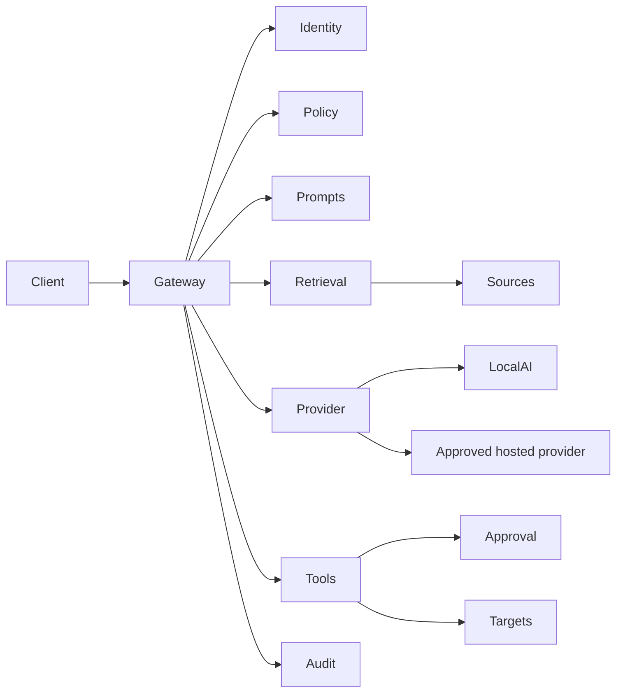

# Internal AI Gateway

The gateway is an internal policy enforcement point, not a public chatbot or
transparent model proxy. Models generate proposals; deterministic services
authorize retrieval and actions.

## Goals

- local and explicitly configured hosted providers;
- provider-independent application API;
- authenticated, permission-aware retrieval;
- versioned prompts/workflows and validated output;
- narrow tools with human approval for risky actions;
- redacted audit evidence;
- read-only knowledge, meeting summaries, extraction, and drafting.

Non-goals: generic shell/browser/HTTP/SQL/CRUD, autonomous external
communication, production mutation, or becoming a canonical data store.

## Components



| Component | Responsibility |
| --- | --- |
| Gateway API | Run a named workflow; return answer, draft, or proposals |
| Identity | Validate Authentik/OIDC or service identity |
| Policy | Authorize workflow, source, provider, tool, target, and limits |
| Prompt registry | Versioned prompt, schemas, allowed sources/tools/providers |
| Retrieval broker | Apply permissions before content enters context |
| Provider adapter | Normalize local/hosted generation and embeddings |
| Tool broker | Validate and authorize narrow domain actions |
| Approval | Bind human approval to exact proposal digest and expiry |
| Audit | Redacted request, decision, proposal, approval, and result events |

## Provider Contract

```text
generate(request) -> response
stream(request)   -> event stream
embed(request)    -> vectors
health()          -> capabilities/status
```

The logical request includes workflow/prompt version, messages, output schema,
allowed tool definitions, token/time limits, and request ID. The response
includes provider/model, validated output, usage, finish reason, and tool
proposals.

Adapters:

- use configured endpoints/credentials only;
- normalize errors, timeout, retry, streaming, and usage;
- declare retention/data-use posture;
- never log credentials or unrestricted prompts;
- never route confidential content to a hosted fallback without policy.

Initial direction: evaluate the existing LocalAI deployment first. Hosted
providers stay disabled until explicitly configured by classification.

## Workflow Contract

Each workflow declares:

```yaml
id: meeting-summary
version: "1"
prompt: meeting-summary-v1
outputSchema: meeting-record-v1
providers: [localai]
sources: [meeting-records]
classifications: [internal, confidential]
tools: [knowledge.record.propose_create]
approval:
  knowledge.record.propose_create: required
limits:
  maxSourceRecords: 1
  maxInputTokens: 16000
  maxOutputTokens: 2000
  timeoutSeconds: 60
retention:
  rawPrompt: none
```

Applications request a reviewed workflow; they do not supply arbitrary system
prompts or provider URLs for privileged operations.

## Retrieval

Before model invocation:

- authorize principal, workspace, source, record, and field;
- cap result count/content size;
- preserve source ID, URL, version, timestamp, and classification;
- redact unnecessary identifiers/secrets;
- separate public and confidential indexes.

Natural-language content cannot expand retrieval scope.

## Tools And Approval

Expose domain actions such as:

```text
github.issue.draft
espocrm.lead.search
espocrm.lead.propose_create
leantime.task.propose_update
knowledge.record.search
```

For each proposal:

1. validate strict arguments;
2. re-authorize independently from the model;
3. enforce target/field/batch limits;
4. generate an exact dry run;
5. bind approval to digest, actor, target, policy version, and expiry;
6. execute idempotently through a constrained connector;
7. audit the result.

The model and service identity cannot approve their own proposal.

## Permissions

Use explicit capabilities:

```text
workflow:meeting-summary:run
source:meeting-records:read
provider:localai:use
tool:knowledge.record.propose_create:propose
tool:knowledge.record.propose_create:approve
tool:knowledge.record.propose_create:execute
```

No wildcard source/tool permissions by default.

## API Direction

```text
POST /v1/workflows/{workflow}:run
POST /v1/workflows/{workflow}:stream
POST /v1/tool-proposals/{id}:approve
POST /v1/tool-proposals/{id}:reject
POST /v1/tool-proposals/{id}:execute
GET  /v1/requests/{id}
GET  /health/live
GET  /health/ready
```

Run/stream may propose actions but never execute them. Execution rechecks policy
and approval.

## Threat Controls

| Risk | Control |
| --- | --- |
| Prompt injection | Retrieved text is untrusted; policy/tool checks outside model |
| Data leakage | Classification-aware retrieval/provider routing |
| Excessive agency | Narrow tools, approval, idempotency, no generic CRUD |
| Unsafe output | Strict schema and downstream validation |
| Cross-user leakage | Principal-aware query and cache partitioning |
| Replay/substitution | Expiring one-time proposal digest |
| Cost/DoS | Token, request, concurrency, retry, timeout, and budget limits |
| Supply chain | Pinned reviewed dependencies/images/models; kill switch |

See `docs/security.md` when merged and the external OWASP/NIST references there.

## Deployment Direction

- dedicated namespace;
- separate API and executor identities/deployments;
- ClusterIP only; no public Ingress by default;
- Authentik/OIDC for human calls;
- allowlisted connector networking;
- resource/concurrency limits and readiness checks;
- structured redacted logs;
- hosted providers disabled without both Secret and policy.

The gateway stores workflow/policy metadata, proposals, approvals, and redacted
audit events. Canonical transcripts, CRM records, tasks, emails, and knowledge
documents stay in their owning systems.

## Implementation Slices

1. **Read-only:** authenticated API, LocalAI adapter, prompt registry, public
   GitHub/Markdown retrieval, schema validation, audit.
2. **Proposals:** narrow tool registry, dry runs, digest/approval state.
3. **One connector:** EspoCRM read/search and approved Lead changes after #29.
4. **Hardening:** negative permissions, injection tests, isolation, retention,
   monitoring, and kill switches under #23.

## Open Decisions

- implementation language/framework;
- initial local model and embedding model;
- audit persistence and retention;
- code/config versus dedicated policy engine;
- gateway-local versus shared approval service;
- first retrieval/search backend;
- allowed hosted providers by classification.

Create focused implementation issues after these choices are reviewed.
