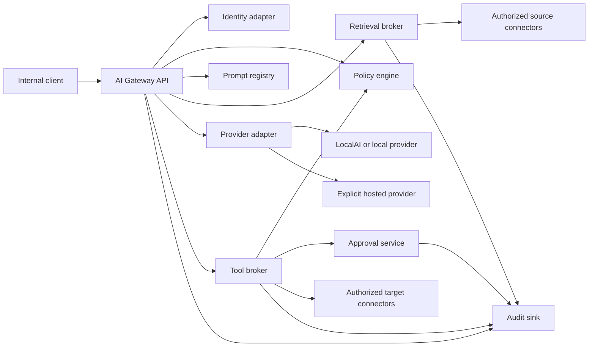

# Internal AI Gateway Architecture

This document proposes the first secure internal AI-services layer for The Keep
Platform. It is an architecture and implementation contract, not a deployed
service.

The gateway is not a general-purpose public chatbot and not a transparent proxy
to model providers. It is a policy enforcement point for authenticated,
auditable, permission-aware AI workflows.

## Goals

- support local and explicitly configured hosted model providers;
- keep application code independent from provider-specific APIs;
- authenticate human and service callers;
- authorize data retrieval and tool actions outside the model;
- version prompts, schemas, policies, and provider configuration;
- record redacted audit evidence for requests and tool actions;
- require human approval for destructive or externally visible actions;
- support read-only assistants, meeting summarization, extraction, issue
  drafting, and internal operations workflows;
- remain useful when a provider is unavailable or disabled.

## Non-Goals

- exposing raw provider credentials to applications or agents;
- unrestricted shell, browser, database, or generic CRUD access;
- autonomous external communication or production changes;
- storing all organizational data in the gateway;
- making model output authoritative;
- choosing one permanent model or vector database in the first implementation;
- serving confidential workloads from a public demo deployment.

## Architectural Principles

1. Models generate proposals; deterministic services make policy decisions.
2. Retrieval permission is enforced before content enters model context.
3. Tool permission is enforced for every call, not only in the system prompt.
4. Approval is bound to an exact proposal digest and expires.
5. Provider adapters receive the minimum context required for the task.
6. All structured output is schema-validated before use.
7. Read, propose, approve, and execute are separate operations.
8. Local and hosted providers use the same policy and audit path.
9. Confidential and public indexes are separate security domains.
10. Failure reduces capability; it never broadens permissions.

## Component Model



### Gateway API

The API:

- accepts authenticated workflow requests;
- resolves the caller and delegated service identity;
- loads a versioned workflow definition;
- obtains authorized context through the retrieval broker;
- invokes the selected provider adapter;
- validates structured output;
- returns a response, draft, or proposed tool actions;
- never executes model-requested actions directly.

### Identity Adapter

The identity adapter validates Authentik/OIDC identity for human callers and a
separate credential for service callers. It emits a normalized principal:

```json
{
  "actorType": "human",
  "actorId": "stable-subject-id",
  "groups": ["internal-member"],
  "delegatedService": "meeting-summary",
  "sessionId": "request-session-id"
}
```

The gateway must not accept user-supplied roles or group claims without
cryptographic validation.

### Policy Engine

The policy engine evaluates:

- principal and delegated service;
- workflow and prompt version;
- deployment class;
- provider;
- source connector and requested fields;
- data classification;
- tool, target, and action risk;
- approval state;
- query, token, cost, and time limits.

Initial policy may be explicit application code and reviewed configuration. A
general policy language should be adopted only when the number and complexity
of policies justify another runtime dependency.

### Prompt Registry

Prompts are named, versioned artifacts with:

- purpose and owner;
- input schema;
- output schema;
- allowed providers and models;
- allowed retrieval sources;
- allowed tools and action levels;
- maximum context and output;
- retention classification;
- test fixtures and expected invariants;
- change history.

Applications request a prompt by stable name and version. They do not submit an
arbitrary system prompt for a privileged workflow.

### Retrieval Broker

The broker:

- authorizes source, record, and field access before retrieval;
- applies repository, project, account, or user scope;
- limits result count and content size;
- preserves source IDs, URLs, timestamps, and classification;
- redacts unnecessary identifiers and secrets;
- separates public, internal, confidential, and restricted indexes;
- returns citations/provenance with every result.

The model cannot expand retrieval scope through natural-language instructions.

### Provider Adapter

Provider adapters normalize local and hosted inference. Provider choice is a
policy decision, not a client-controlled URL.

The minimum interface is:

```text
generate(request) -> response
stream(request) -> event stream
embed(request) -> vectors
health() -> provider status and capabilities
```

Logical request:

```json
{
  "requestId": "uuid",
  "modelClass": "summarization",
  "messages": [],
  "tools": [],
  "outputSchema": {},
  "limits": {
    "maxInputTokens": 16000,
    "maxOutputTokens": 2000,
    "timeoutMs": 60000
  },
  "metadata": {
    "workflow": "meeting-summary",
    "promptVersion": "1"
  }
}
```

Logical response:

```json
{
  "provider": "localai",
  "model": "configured-model-id",
  "finishReason": "stop",
  "output": {},
  "usage": {
    "inputTokens": 0,
    "outputTokens": 0
  },
  "toolProposals": []
}
```

Adapters must:

- use configured endpoints and credentials only;
- normalize timeouts, retries, streaming, and error codes;
- expose capability metadata;
- redact provider errors before returning them to clients;
- never log raw credentials or unrestricted prompts;
- declare provider retention and data-use posture.

Initial provider direction:

- use the existing LocalAI deployment for local evaluation where its model
  capabilities are sufficient;
- keep hosted providers disabled until explicitly configured;
- require per-provider classification rules so confidential prompts cannot
  silently fall back to an external provider.

### Tool Broker

The tool broker exposes narrow domain actions such as:

```text
github.issue.draft
espocrm.lead.search
espocrm.lead.propose_create
leantime.task.propose_update
knowledge.record.search
```

It does not expose generic HTTP, shell, SQL, browser, or arbitrary entity CRUD
to model-selected arguments.

For every tool proposal it:

1. validates the tool and argument schema;
2. re-authorizes the action independently of the model;
3. checks target and field allowlists;
4. calculates action risk;
5. generates a normalized dry-run;
6. requires approval when policy says so;
7. executes idempotently through a connector;
8. emits an audit event.

### Approval Service

The approval service stores:

- proposal digest;
- exact target and changes;
- requesting actor and workflow;
- approving human;
- issue and expiration time;
- one-time or bounded-use state;
- execution result.

The executor rejects approvals whose proposal, actor, target, or policy version
has changed.

### Audit Sink

The audit sink records:

- actor and service identity;
- workflow, prompt, policy, provider, and model versions;
- source references and classifications;
- tool proposal and action category;
- approval state;
- redacted input/output summaries;
- token, latency, cost, denial, and error metrics;
- final target record IDs.

Audit payloads must not become a secondary copy of confidential source data.
The baseline event shape should align with #20.

## Workflow Definition

Each enabled workflow is declarative and reviewable:

```yaml
id: meeting-summary
version: "1"
prompt: meeting-summary
outputSchema: meeting-summary-v1
providers:
  - localai
retrieval:
  sources:
    - meeting-records
  classifications:
    - internal
    - confidential
tools:
  - knowledge.record.propose_create
approval:
  knowledge.record.propose_create: required
limits:
  maxSourceRecords: 1
  maxInputTokens: 16000
  maxOutputTokens: 2000
  timeoutSeconds: 60
retention:
  rawPrompt: none
  outputDays: 30
```

This is a logical contract. The first implementation may use YAML or code-backed
configuration, but it must validate the same fields.

## API Shape

Initial endpoints:

```text
POST /v1/workflows/{workflow}:run
POST /v1/workflows/{workflow}:stream
POST /v1/tool-proposals/{proposalId}:approve
POST /v1/tool-proposals/{proposalId}:reject
POST /v1/tool-proposals/{proposalId}:execute
GET  /v1/requests/{requestId}
GET  /health/live
GET  /health/ready
```

Rules:

- `run` and `stream` may return tool proposals but do not execute them;
- approval requires a human identity with the required role;
- execution checks approval again and may use a separate executor identity;
- request status returns redacted metadata, not raw confidential context;
- readiness fails when required policy, prompt, provider, or audit dependencies
  are unavailable.

## Permission Model

Permissions are explicit capabilities:

```text
workflow:meeting-summary:run
source:meeting-records:read
provider:localai:use
tool:knowledge.record.propose_create:propose
tool:knowledge.record.propose_create:approve
tool:knowledge.record.propose_create:execute
```

No principal receives wildcard tool or source permissions by default.

Separation of duties:

- a model may propose;
- a requesting service may submit the proposal;
- an authorized human approves;
- a constrained executor applies it;
- the audit service records all stages.

For low-risk internal writes, a maintainer may later approve a bounded workflow
policy that removes per-action approval. That exception must define exact
targets, fields, volume, rollback, and expiry.

## Threat Model

| Threat | Control |
| --- | --- |
| Direct or indirect prompt injection | Retrieved content is untrusted; policy and tool checks occur outside the model |
| Data leakage to a provider | Classification-aware provider policy, minimization, hosted providers disabled by default |
| Overbroad retrieval | Source/record/field authorization before context assembly |
| Excessive agency | Narrow tools, no generic CRUD, approval, idempotency, execution separation |
| Insecure model output | Schema validation, escaping, enum and field allowlists |
| Credential exposure | Provider credentials remain server-side and out of logs/prompts |
| Cross-user data exposure | Principal-aware retrieval and cache partitioning |
| Replay or proposal substitution | Expiring proposal digest and one-time approval |
| Cost or denial-of-service | Request, token, concurrency, retry, and budget limits |
| Provider compromise or drift | Pinned configuration, health checks, kill switch, explicit provider routing |
| Audit data leakage | Redacted summaries, restricted audit access, retention limits |
| Supply-chain compromise | Reviewed pinned dependencies and isolated evaluation |

## Storage And Retention

The gateway should store only:

- workflow and prompt definitions;
- policy configuration;
- request metadata;
- tool proposals and approvals;
- redacted audit events;
- optional short-lived validated outputs when required by the workflow.

It should not become the canonical store for:

- transcripts;
- CRM records;
- project tasks;
- email bodies;
- knowledge documents.

Raw prompts and provider responses default to no persistent retention. Workflows
that require retention must declare purpose, classification, duration, deletion
behavior, and access policy.

## Kubernetes Deployment Direction

The initial internal deployment should use:

- a dedicated namespace;
- one API deployment and one constrained executor deployment;
- separate service accounts and credentials;
- ClusterIP-only Services;
- no public Ingress by default;
- Authentik/OIDC validation for human requests;
- NetworkPolicies before access to confidential connectors;
- CPU, memory, concurrency, and timeout limits;
- readiness checks for policy, audit, and required provider dependencies;
- structured logs with payload redaction;
- disabled hosted providers unless their Secret and policy are present.

The executor should not share the API pod's broad network or credentials.

## Initial Use Cases

### Read-Only Knowledge Assistant

- public GitHub and selected internal Markdown sources;
- cited answers;
- no tools with write capability;
- source permission applied before retrieval.

### Meeting Summary

- one approved transcript record;
- structured summary, decisions, actions, and open questions;
- no automatic task or CRM creation;
- optional proposed knowledge record requiring approval.

### GitHub Issue Drafting

- public or explicitly approved internal context;
- returns title/body/acceptance-criteria draft;
- cannot publish or close an issue.

### Internal Operations Assistant

- starts read-only;
- returns diagnostic commands and evidence;
- cannot run production commands or synchronize Argo CD.

## Implementation Slices

### Slice 1: Read-Only Gateway

- authenticated API;
- LocalAI adapter;
- versioned prompt registry;
- public GitHub/Markdown retrieval;
- schema validation;
- redacted request audit;
- no write tools.

### Slice 2: Proposal Framework

- narrow tool registry;
- dry-run proposals;
- proposal digest and approval state;
- no external or destructive tools.

### Slice 3: One Internal Connector

- EspoCRM read/search and Lead create/update proposal;
- field allowlist and duplicate checks;
- approved execution only;
- per-write audit event.

### Slice 4: Hardening

- negative permission tests;
- indirect prompt-injection fixtures;
- network isolation;
- retention enforcement;
- provider failover rules that preserve classification;
- operational dashboards and alerts.

Slice 4 is tracked by #23 and must review the actual implementation rather than
only this proposal.

## Follow-Up Issues To Create After Review

- Implement gateway skeleton, identity normalization, and health endpoints.
- Implement LocalAI provider adapter and capability discovery.
- Add versioned workflow/prompt registry and schema validation.
- Implement public GitHub/Markdown retrieval with source citations.
- Implement structured redacted audit sink.
- Implement proposal digest, human approval, and constrained executor.
- Add EspoCRM read/search and dry-run Lead tools after #29.
- Add security verification and prompt-injection test suite under #23.
- Add monitoring for latency, denials, provider failures, and usage budgets.

These should be separate implementation issues so provider, connector, and
security work can be reviewed independently.

## Open Decisions

- implementation language and framework;
- initial LocalAI model and embedding model;
- audit-event persistence backend and retention;
- policy representation: application code, configuration, or dedicated engine;
- whether approvals live in the gateway or a shared platform service;
- first internal retrieval store and vector/search backend;
- hosted providers permitted for each data classification.

No production implementation should silently choose these on behalf of the
maintainer.
