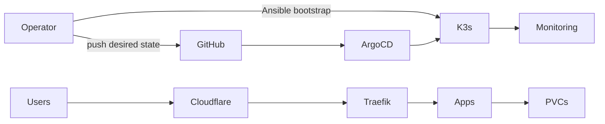

# Platform Architecture

This is the detailed companion to the README overview. It describes what exists
today and avoids presenting planned work as implemented.

## Current Shape



The current production-like environment is one k3s control-plane host with
local persistent volumes. It is recoverable, but it is not highly available.

## Responsibilities

| Layer | Responsibility |
| --- | --- |
| Ansible | Provision the host, install k3s, seed Secrets, bootstrap Argo CD, run validation |
| Git | Long-term desired state and review boundary |
| Argo CD | Reconcile committed Kubernetes manifests and Helm values |
| k3s | Run workloads, networking, storage claims, and service discovery |
| Cloudflare Tunnel | Provide the outbound public edge path |
| Traefik | Route host/path traffic to Kubernetes Services |
| Authentik | Central identity; native OIDC where practical, forward-auth otherwise |
| Prometheus/Grafana/Loki | Metrics, alerts, dashboards, and logs |

Manual cluster changes are diagnostic only unless reconciled back into Git.

## GitOps Graph

`platform-root` discovers the child applications in `kubernetes/gitops/apps/`:

```text
platform-root
├── platform-cloudflare-tunnel
├── platform-authentik
├── platform-leantime
├── platform-wisemapping
├── platform-baserow
├── platform-monitoring-prometheus
├── platform-monitoring-loki
├── platform-crm-twenty   optional
└── platform-crm-espocrm  optional
```

Most apps self-heal but do not prune automatically. This is deliberate for
stateful services: deletion remains an explicit operational action.

## Runtime Boundaries

| Namespace | Workload |
| --- | --- |
| `argocd` | GitOps |
| `identity` | Authentik |
| `default` | Leantime |
| `wisemapping` | WiseMapping |
| `baserow` | Baserow |
| `espocrm`, `twenty` | Optional CRM apps |
| `monitoring` | Prometheus, Grafana, Loki, Promtail |
| `kube-system` | Cloudflare Tunnel and cluster services |

The public request path is:

```text
client -> Cloudflare -> Tunnel -> Traefik -> Service -> Pod
```

Authentik is the intended shared identity boundary, but applications still own
their record-level authorization.

## Data And Recovery

- Stateful apps use local `ReadWriteOnce` volumes.
- Backup CronJobs exist for Leantime and enabled CRM/data apps.
- Backups are generally cluster-local; off-cluster replication is not yet a
  platform guarantee.
- A successful backup is not proof of restore. Restore drills and explicit
  RPO/RTO targets remain planned work.
- Runtime data and credentials do not belong in Git.

## Deployment Flow

1. Create one focused branch.
2. Run static checks and a disposable k3d smoke test when practical.
3. Merge after review.
4. Let Argo CD reconcile the merged revision.
5. Run production validation with the correct host and privileges.
6. Verify the affected user workflow, not only pod health.

Production deployment and final risk acceptance remain human-controlled.

## Environment Boundaries

- **Internal:** confidential operating data; authenticated access required.
- **Local development:** disposable k3d and deterministic synthetic secrets.
- **Public demo (planned):** separate deployment and synthetic data only.

Demo mode must never be a flag that exposes the internal database.

## Known Gaps

- Single control-plane and storage failure domain.
- No uniform off-cluster backup and restore verification.
- Secrets are not yet managed through SOPS or External Secrets.
- Authentik provider/application setup is not fully automated.
- Promtail should migrate to Grafana Alloy.
- AI services, meeting memory, and public demo mode are design work, not current
  capabilities.

The deeper operational commands remain in the README and focused runbooks; this
document records architecture, not another operations manual.
