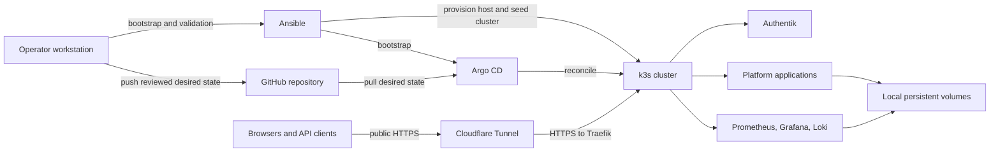

# Platform Architecture

This document describes the architecture that exists in this repository today,
the operating model around it, and the direction that is planned but not yet
implemented.

Status labels used below:

- **Current:** represented in committed configuration and used by the platform.
- **Partial:** implemented for some services or dependent on manual operator
  configuration.
- **Planned:** an intended direction, not a capability that should be assumed.

## System Context



The current production-like deployment is a single k3s control-plane host. The
diagram includes the intended local/VPS portability boundary, but it does not
mean that a multi-cluster or highly available topology exists today.

## Control Plane

### Ansible Bootstrap

**Current**

`ansible/setup_k3s_production.yml` is the production entrypoint. It:

1. validates local production configuration and required secrets;
2. provisions the k3s host and the `k3s-admin` operating account;
3. renders and verifies the GitOps application definitions;
4. seeds the Kubernetes Secrets required by enabled services;
5. installs or reconciles Argo CD;
6. runs platform validation gates.

Ansible owns machine and cluster bootstrap. It is not the preferred day-two
application deployment mechanism.

### GitOps Reconciliation

**Current**

Argo CD is the day-two reconciliation engine. The root application at
`kubernetes/gitops/root/platform-root.application.yaml` discovers child
applications from `kubernetes/gitops/apps/`.

The application graph is:

```text
platform-root
├── platform-cloudflare-tunnel
├── platform-authentik
├── platform-leantime
├── platform-wisemapping
├── platform-baserow
├── platform-monitoring-prometheus
├── platform-monitoring-loki
├── platform-crm-twenty       optional
└── platform-crm-espocrm      optional
```

Most applications use automated self-healing. Pruning is deliberately disabled
for most stateful application paths so resource removal remains an explicit
operational decision. Loki is currently an exception and has automated pruning
enabled.

Git is the desired-state boundary. Manual cluster changes are temporary
diagnostic actions unless they are reconciled back into manifests, values, or
Ansible.

## Runtime Topology

### Cluster Shape

**Current**

- One k3s server/control-plane failure domain.
- Traefik is the in-cluster ingress controller.
- Application workloads use Kubernetes namespaces and Services for isolation
  and discovery.
- Persistent applications use local `ReadWriteOnce` persistent volumes.

**Planned**

- Three-server k3s control plane with etcd quorum.
- Separate worker nodes where scheduling or resource isolation justifies them.
- Replicated storage and explicit placement policies.
- Provider-portable local and VPS clusters managed through the same contracts.

The current deployment is recoverable and production-like, but it is not highly
available. Loss of the control-plane host or its local storage can interrupt the
entire platform.

### Application Boundaries

| Area | Namespace | Purpose | Status |
| --- | --- | --- | --- |
| Argo CD | `argocd` | GitOps reconciliation and application health | Current |
| Identity | `identity` | Authentik and forward-auth components | Current/Partial |
| Leantime | `default` | Project and workload management | Current |
| WiseMapping | `wisemapping` | Mind mapping | Current |
| Baserow | `baserow` | Relationship and structured operating data | Current |
| EspoCRM | `espocrm` | Optional active opportunity CRM | Optional |
| Twenty | `twenty` | Optional CRM evaluation/deployment | Optional |
| Monitoring | `monitoring` | Metrics, dashboards, alerts, and logs | Current |
| Cloudflare Tunnel | `kube-system` | Outbound edge connector | Current |

Optional applications are controlled by production variables and included in
the rendered Argo CD application set only when enabled.

## Network And Access Path

### Public HTTPS

**Current**

The supported public path is:

```text
client -> Cloudflare edge -> Cloudflare Tunnel -> Traefik -> application Service
```

The tunnel avoids opening a public inbound port on the LAN origin. Cloudflare
forwards to Traefik over HTTPS. The internal Traefik certificate is self-signed,
so the configured Cloudflare origin uses `No TLS Verify`.

Ingress hostnames and routing remain part of the GitOps desired state. A
Cloudflare hostname alone is not sufficient; the matching Kubernetes Ingress
must also exist.

### Authentication

**Partial**

Authentik is the intended platform identity hub:

- native OIDC is preferred when an application supports it cleanly;
- Authentik forward-auth is available for applications that need an external
  authentication gate;
- middleware attachment remains deliberate and is not globally enabled;
- some providers, applications, and client credentials still require manual
  Authentik configuration.

Application-level authorization still matters behind a shared identity layer.
Forward-auth proves identity at the edge but does not replace record-level or
tool-level permissions inside an application.

## Data And Storage

### Persistent State

**Current**

Stateful applications use Kubernetes persistent volume claims. The current
single-node storage model prioritizes straightforward recovery over
high-availability failover.

Application manifests, configuration, and operational scripts belong in Git.
Database contents, uploaded files, credentials, and other runtime state do not.

### Backup And Restore

**Partial**

Backup CronJobs exist for Leantime, Baserow, EspoCRM, and Twenty where those
applications are enabled. Leantime also has on-demand backup and restore helper
scripts.

Current limitations:

- backups generally remain on cluster-local persistent volumes;
- off-cluster replication is not yet a platform-managed guarantee;
- routine restore drills and explicit recovery objectives are not yet
  automated for every service;
- a successful backup Job is not proof of a successful restore.

**Planned**

- encrypted off-cluster replication;
- defined RPO and RTO per stateful service;
- scheduled restore verification;
- etcd backup and recovery procedures appropriate for a multi-server cluster.

## Observability

**Current**

- Prometheus and kube-prometheus-stack provide metrics and alert rules.
- Grafana provides dashboards and exploration.
- Loki stores application and platform logs.
- Promtail ships pod logs to Loki.
- Production validation checks selected application endpoints, workloads,
  backups, GitOps status, and observability APIs.

Promtail is deprecated upstream and migration to Grafana Alloy is planned.
Monitoring availability does not replace user-workflow validation; production
changes should verify both workload health and the affected UI or API path.

## Internal, Demo, And Public Boundaries

### Internal Deployment

**Current**

The deployed platform is treated as a confidential, directly controlled
operating environment. It may contain private project, CRM, relationship, and
job-search information. Access controls and backups must preserve that
assumption.

### Local Development

**Current**

Disposable k3d workflows render and exercise applications without targeting the
production cluster. Deterministic development secrets and local-only patches
support repeatable smoke testing. See `docs/local-iac-testing.md`.

### Public Demo

**Planned**

A safe public demo must use synthetic organizations, people, opportunities,
meetings, and project data. Production exports, CRM records, contact data, and
private operational history must never be used as demo fixtures.

Demo mode should be a separate data and access boundary, not a flag that makes a
confidential production database public.

## Security Boundaries

**Current**

- production variables and credentials are local and ignored by Git;
- Kubernetes Secrets are seeded by Ansible;
- public services are exposed through Cloudflare Tunnel and Traefik;
- Authentik provides the intended central identity boundary;
- the repository includes validation for selected ingress, authentication,
  backup, and observability behavior.

**Planned**

- SOPS or External Secrets for encrypted/delegated secret management;
- stricter RBAC and short-lived elevated access;
- admission controls for dangerous changes;
- mandatory review and status checks for infrastructure paths;
- complete audit and approval controls before AI tools receive write access.

The security model must assume that AI-generated text, imported content, issue
comments, and third-party documentation can contain hostile instructions.
Automation may not treat retrieved text as authority to use tools or cross data
boundaries.

## Deployment Lifecycle

The expected change path is:

1. create one focused branch;
2. update manifests, values, Ansible, tests, and documentation together;
3. run static rendering and syntax checks;
4. run a disposable local smoke test when practical;
5. review and merge through GitHub;
6. allow Argo CD to reconcile the merged revision;
7. run production validation with the correct host, kubeconfig, and privileges;
8. verify the user-visible workflow;
9. document any incident finding or lasting operational constraint.

Production deployment and final risk acceptance remain human-controlled
operations.

## Known Architectural Gaps

- Single control-plane and storage failure domain.
- Backups are not uniformly replicated or restore-tested off cluster.
- Secret management is not yet encrypted in Git or delegated to an external
  secret store.
- Authentik provider/application creation is not fully automated.
- AI service, meeting intelligence, and knowledge-memory layers are design work,
  not current platform capabilities.
- Public demo isolation and synthetic seed/reset workflows are not implemented.
- Optional CRM applications increase operational scope and require deliberate
  enablement, backups, and access controls.

These gaps are constraints to design around, not capabilities to imply in
product or operational claims.
